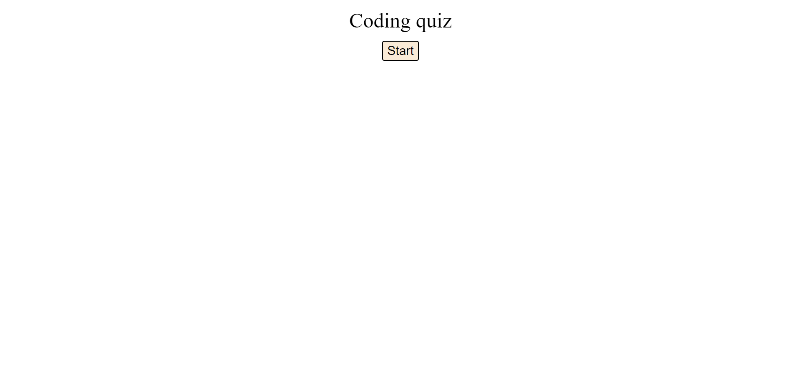

# JavaScript Quiz

## Description
The quiz will prompt you to press start, you will then have 120seconds to complete the quiz. With each incorrect answer you will be deducted 10 seconds from your time. Once you run out of time or finish all the questions you will be presented with the option to submit your intitals. Once submited you will be taken to a page where your scores will be tracked. Each time you revisit the quiz your previous scores will be saved on your highscore list.